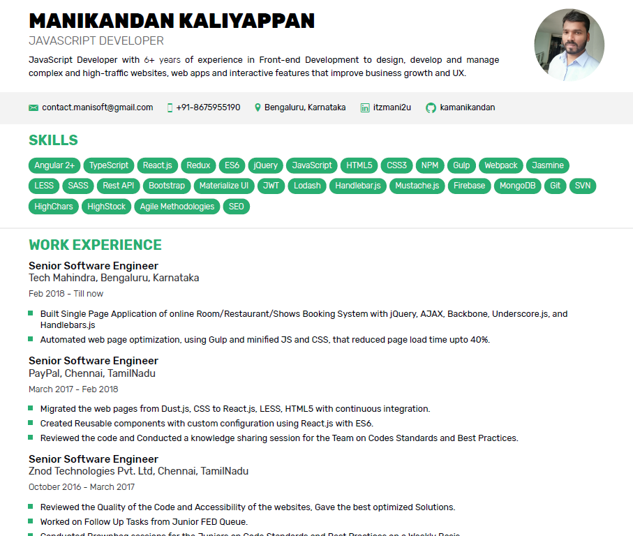

"# my-resume"

# Tech Mahindra:

Performance Optimization

Accelerated title loading by 50%: Implemented web workers and caching strategies to significantly reduce loading times, enhancing user experience.
Streamlined pagination and indexing: Restructured complex pagination and A-Z indexing components into simpler, more efficient designs, boosting performance and usability.
Technical Leadership

Headed jQuery upgrade initiative: Led a team of 5 developers to successfully upgrade jQuery to the latest version, ensuring compliance with Veracode security standards.
Championed backend and frontend pagination: Spearheaded integration of backend and frontend pagination into the Publishing GUI, resulting in smoother title loading and enhanced user experience.
Integration Expertise

Seamlessly integrated eSSO authentication: Facilitated TR-wide eSSO authentication for the PV Ticketing Tool app, streamlining user access and security.
Efficiently embedded My Data Privacy workflows: Successfully integrated OneTrust My Data Privacy workflows into Proview, ensuring compliance with data privacy regulations.
Team Leadership

Mentored and guided a team of 5 developers: Effectively led and managed a team of developers in multiple projects, promoting collaboration and knowledge sharing.
Fostered a culture of continuous improvement: Encouraged team members to explore new technologies and techniques to optimize application performance and user experience.
